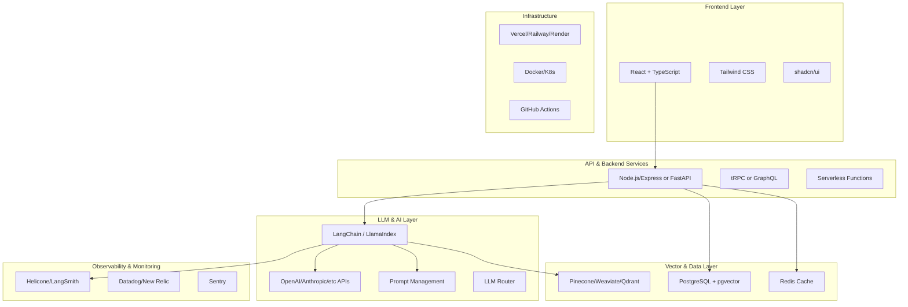

# AI-Native Technology Stack

## Overview
This document recommends an AI-native technology stack for the Universal Blindspot Radar SaaS MVP, optimized for LLM prompting, reasoning workflows, vector search, RAG, and production operations.

---

## Stack Architecture



---

## 1. LLM Prompting & Reasoning Workflows

### Primary LLM Providers

#### OpenAI (Recommended for MVP)
- **Models:** GPT-4, GPT-4-turbo, GPT-3.5-turbo
- **Strengths:** Best general performance, extensive tooling, reliable
- **Use Cases:** Complex reasoning, code generation, primary workflows
- **Cost:** ~$0.01-0.03 per 1K tokens (input/output)
- **Integration:** Official SDK with streaming support

```typescript
// Example implementation
import OpenAI from 'openai';

const openai = new OpenAI({
  apiKey: process.env.OPENAI_API_KEY,
});

const completion = await openai.chat.completions.create({
  model: "gpt-4-turbo",
  messages: [
    { role: "system", content: systemPrompt },
    { role: "user", content: userQuery }
  ],
  temperature: 0.7,
  max_tokens: 2000,
});
```

#### Anthropic Claude (Recommended for Safety & Long Context)
- **Models:** Claude 3 Opus, Sonnet, Haiku
- **Strengths:** Strong safety, 200K context window, constitutional AI
- **Use Cases:** Sensitive data, document analysis, safety-critical tasks
- **Cost:** Competitive with OpenAI
- **Integration:** Official SDK

#### Fallback Strategy
- **Primary:** OpenAI GPT-4-turbo
- **Secondary:** Anthropic Claude Sonnet (if primary fails)
- **Tertiary:** GPT-3.5-turbo (for cost optimization)

### LLM Orchestration Frameworks

#### LangChain (Recommended)
**Version:** 0.1.x+ (TypeScript or Python)

**Why LangChain:**
- Mature ecosystem with extensive integrations
- Built-in support for prompt templates
- Chain and agent abstractions
- Strong RAG support
- Active community and documentation

**Core Features:**
- Prompt templates and management
- Chain-of-thought implementations
- ReAct agents
- Memory management
- Tool/function calling
- Output parsers

```typescript
// Example LangChain usage
import { ChatOpenAI } from "langchain/chat_models/openai";
import { PromptTemplate } from "langchain/prompts";
import { LLMChain } from "langchain/chains";

const template = new PromptTemplate({
  template: `You are a compliance expert. {context}\n\nQuestion: {question}`,
  inputVariables: ["context", "question"],
});

const model = new ChatOpenAI({
  modelName: "gpt-4-turbo",
  temperature: 0,
});

const chain = new LLMChain({ llm: model, prompt: template });

const response = await chain.call({
  context: retrievedDocuments,
  question: userQuery,
});
```

#### Alternative: LlamaIndex (Specialized for RAG)
- Excellent for document-heavy applications
- Superior indexing and retrieval
- Built-in evaluation metrics
- Consider if RAG is >80% of use cases

### Prompt Management Systems

#### Recommended: LangSmith
**Features:**
- Prompt versioning and testing
- A/B testing capabilities
- Performance monitoring
- Dataset management
- Collaborative prompt editing

**Integration:**
```typescript
import { Client } from "langsmith";

const client = new Client({
  apiKey: process.env.LANGSMITH_API_KEY,
});

// Log prompt execution
await client.run({
  name: "compliance_query",
  inputs: { query: userQuery },
  outputs: { response: llmResponse },
  tags: ["production", "compliance"],
});
```

#### Alternative: PromptLayer
- Simpler interface
- Cost tracking
- Request logging
- Good for smaller teams

#### Alternative: Helicone (Open Source)
- Self-hostable
- Cost tracking
- Caching layer
- Rate limiting

---

## 2. Vector Search & RAG Infrastructure

### Vector Databases

#### Option 1: Pinecone (Recommended for MVP)
**Why Pinecone:**
- Fully managed, zero ops
- Excellent performance
- Simple API
- Built-in metadata filtering
- Generous free tier

**Setup:**
```typescript
import { Pinecone } from '@pinecone-database/pinecone';

const pinecone = new Pinecone({
  apiKey: process.env.PINECONE_API_KEY,
});

const index = pinecone.Index('compliance-docs');

// Upsert vectors
await index.upsert([{
  id: 'doc-1',
  values: embedding,
  metadata: {
    source: 'GDPR Article 32',
    category: 'data-security',
    date: '2024-01-15',
  }
}]);

// Query
const results = await index.query({
  vector: queryEmbedding,
  topK: 5,
  includeMetadata: true,
  filter: { category: 'data-security' }
});
```

**Pricing:** 
- Free tier: 1 pod (suitable for MVP)
- Paid: Starts at $70/month

#### Option 2: Weaviate (Best for Complex Queries)
**Advantages:**
- Hybrid search (vector + keyword)
- Built-in vectorization
- GraphQL API
- Can self-host

**When to use:** Need hybrid search or complex filtering

#### Option 3: Qdrant (Best for Self-Hosting)
**Advantages:**
- Open source, self-hostable
- Excellent performance
- Good filtering capabilities
- Cost-effective at scale

#### Option 4: PostgreSQL + pgvector (Budget Option)
**Advantages:**
- Use existing PostgreSQL infrastructure
- No new service to manage
- Good for smaller datasets (<1M vectors)

**Setup:**
```sql
CREATE EXTENSION vector;

CREATE TABLE documents (
  id SERIAL PRIMARY KEY,
  content TEXT,
  embedding vector(1536),
  metadata JSONB
);

CREATE INDEX ON documents USING ivfflat (embedding vector_cosine_ops);
```

### Embedding Models

#### Recommended: OpenAI text-embedding-3-large
- **Dimensions:** 3072 (configurable)
- **Cost:** $0.13 per 1M tokens
- **Quality:** Excellent
- **Max tokens:** 8191

```typescript
const embedding = await openai.embeddings.create({
  model: "text-embedding-3-large",
  input: text,
});
```

#### Alternative: Cohere Embed v3
- Better multilingual support
- Compression options
- Competitive pricing

### Chunking Strategies

#### Recommended Library: LangChain Text Splitters
```typescript
import { RecursiveCharacterTextSplitter } from "langchain/text_splitter";

const splitter = new RecursiveCharacterTextSplitter({
  chunkSize: 1000,
  chunkOverlap: 200,
  separators: ["\n\n", "\n", ". ", " ", ""],
});

const chunks = await splitter.splitText(documentText);
```

#### Chunking Strategy by Document Type:
- **Regulations/Legal Docs:** Semantic chunking by section (500-1000 tokens)
- **Internal Policies:** Fixed-size with overlap (800 tokens, 100 overlap)
- **Audit Reports:** By finding/recommendation (variable size)
- **Technical Docs:** By heading/section (semantic boundaries)

---

## 3. Backend Services

### Application Framework

#### Option 1: Node.js + Express/Fastify (Recommended)
**Advantages:**
- Same language as frontend (TypeScript)
- Excellent LLM library support
- Large ecosystem
- Good for real-time features (SSE/WebSockets)

**Stack:**
```
- Runtime: Node.js 20+
- Framework: Express.js or Fastify
- Type Safety: TypeScript
- Validation: Zod
- ORM: Prisma
- API: tRPC or GraphQL
```

**Example API Structure:**
```typescript
// src/api/compliance.ts
import { z } from 'zod';
import { router, protectedProcedure } from './trpc';

export const complianceRouter = router({
  query: protectedProcedure
    .input(z.object({
      query: z.string(),
      context: z.object({
        industry: z.string().optional(),
        jurisdiction: z.string().optional(),
      }).optional(),
    }))
    .mutation(async ({ input, ctx }) => {
      // RAG retrieval
      const relevantDocs = await retrieveDocuments(input.query);
      
      // LLM call with context
      const response = await generateResponse({
        query: input.query,
        context: relevantDocs,
        user: ctx.user,
      });
      
      return response;
    }),
});
```

#### Option 2: Python + FastAPI (Better for ML Workloads)
**Advantages:**
- Stronger ML ecosystem
- Better for custom model fine-tuning
- Excellent async support
- Automatic OpenAPI docs

**When to use:** Heavy ML/data science work, custom models

```python
from fastapi import FastAPI, Depends
from pydantic import BaseModel

app = FastAPI()

class ComplianceQuery(BaseModel):
    query: str
    context: dict | None = None

@app.post("/api/compliance/query")
async def query_compliance(
    req: ComplianceQuery,
    user = Depends(get_current_user)
):
    docs = await retrieve_documents(req.query)
    response = await generate_response(req.query, docs)
    return response
```

### API Design

#### Recommended: tRPC (Type-Safe RPC)
**Advantages:**
- End-to-end type safety
- No code generation
- Excellent DX with TypeScript
- React Query integration

```typescript
// Backend
export const appRouter = router({
  compliance: complianceRouter,
  risk: riskRouter,
  audit: auditRouter,
});

export type AppRouter = typeof appRouter;

// Frontend
import { createTRPCReact } from '@trpc/react-query';
const trpc = createTRPCReact<AppRouter>();

// Type-safe call
const { data } = trpc.compliance.query.useMutation();
```

#### Alternative: GraphQL (Better for Complex Queries)
- Use if you need flexible querying
- Apollo Server + Apollo Client
- Good for multiple clients (web, mobile)

---

## 4. Authentication & Authorization

### Authentication Provider

#### Recommended: Clerk (Best DX)
**Features:**
- Complete auth solution
- Pre-built UI components
- MFA, SSO, OAuth
- User management dashboard
- Generous free tier

```typescript
import { ClerkProvider, SignedIn, SignedOut } from "@clerk/nextjs";

export default function App({ children }) {
  return (
    <ClerkProvider>
      <SignedIn>{children}</SignedIn>
      <SignedOut><LoginPage /></SignedOut>
    </ClerkProvider>
  );
}
```

**Pricing:** Free up to 10K MAU

#### Alternative: Auth0
- More enterprise features
- More customization
- Higher cost

#### Alternative: Supabase Auth
- Open source
- Part of Supabase ecosystem
- Self-hostable

### Authorization (RBAC)

#### Recommended: Custom RBAC with Prisma
```prisma
model User {
  id    String @id @default(cuid())
  email String @unique
  role  Role
  
  organization   Organization @relation(fields: [organizationId], references: [id])
  organizationId String
}

enum Role {
  ADMIN
  COMPLIANCE_OFFICER
  RISK_ANALYST
  AUDITOR
  VIEWER
}

model Permission {
  id         String @id @default(cuid())
  role       Role
  resource   String
  action     String
  conditions Json?
}
```

#### Alternative: Permify (Advanced RBAC)
- Google Zanzibar-style authorization
- Fine-grained permissions
- Relationship-based access control

---

## 5. Billing & Payments

### Recommended: Stripe
**Features:**
- Complete payment solution
- Subscription management
- Usage-based billing support
- Tax calculation
- Strong API and SDK

```typescript
import Stripe from 'stripe';
const stripe = new Stripe(process.env.STRIPE_SECRET_KEY);

// Create subscription
const subscription = await stripe.subscriptions.create({
  customer: customerId,
  items: [{ price: 'price_xxx' }],
  payment_behavior: 'default_incomplete',
  payment_settings: { save_default_payment_method: 'on_subscription' },
});

// Usage-based billing for LLM calls
await stripe.subscriptionItems.createUsageRecord(
  subscriptionItemId,
  { quantity: llmApiCalls, timestamp: 'now' }
);
```

**Plans Structure:**
- **Free:** 100 LLM queries/month, basic features
- **Pro:** $99/mo, 5K queries, advanced features
- **Enterprise:** Custom, unlimited, white-label

---

## 6. Deployment & Infrastructure

### Hosting Platform

#### Recommended: Vercel (Best for Next.js/React)
**Advantages:**
- Zero-config deployment
- Excellent DX
- Edge functions
- Built-in preview environments
- Free SSL

**When to use:** React/Next.js frontend + API routes

#### Alternative: Railway (Best for Full-Stack)
**Advantages:**
- PostgreSQL, Redis included
- Docker support
- Simple pricing
- Good for monorepos

#### Alternative: Render
**Advantages:**
- Free tier includes PostgreSQL
- Auto-scaling
- Cron jobs
- Background workers

#### For Complex Workloads: AWS/GCP/Azure
**Use when:**
- Need advanced services (SageMaker, BigQuery, etc.)
- Compliance requirements (HIPAA, SOC 2)
- Already have enterprise agreements

**Recommended Services:**
- **Compute:** ECS/Fargate, Cloud Run, or Azure Container Apps
- **Database:** RDS PostgreSQL
- **Cache:** ElastiCache Redis
- **Storage:** S3/Cloud Storage/Blob Storage
- **Monitoring:** CloudWatch/Cloud Monitoring

### Containerization

```dockerfile
# Dockerfile
FROM node:20-alpine AS base

WORKDIR /app
COPY package*.json ./
RUN npm ci --only=production

COPY . .
RUN npm run build

EXPOSE 3000
CMD ["npm", "start"]
```

```yaml
# docker-compose.yml
version: '3.8'
services:
  app:
    build: .
    ports:
      - "3000:3000"
    environment:
      - DATABASE_URL=postgresql://...
      - OPENAI_API_KEY=${OPENAI_API_KEY}
    depends_on:
      - db
      - redis
  
  db:
    image: postgres:16
    volumes:
      - postgres_data:/var/lib/postgresql/data
    environment:
      POSTGRES_DB: compliance_db
  
  redis:
    image: redis:7-alpine
    volumes:
      - redis_data:/data

volumes:
  postgres_data:
  redis_data:
```

---

## 7. Versioning, Testing & Monitoring

### Prompt Versioning

#### Recommended: Git-based + Database
```typescript
// Store prompts in database with versions
interface PromptTemplate {
  id: string;
  name: string;
  version: string; // semver
  template: string;
  variables: string[];
  framework: string[];
  status: 'draft' | 'active' | 'deprecated';
  performance: {
    accuracy?: number;
    latency_p95?: number;
    cost_per_request?: number;
    satisfaction?: number;
  };
  createdAt: Date;
  updatedAt: Date;
}

// Version in Git for review
// /prompts/compliance-officer/query-v1.0.0.yaml
```

#### Prompt Testing Framework
```typescript
// test/prompts/compliance-query.test.ts
import { testPrompt } from '@/lib/prompt-testing';

describe('Compliance Query Prompt', () => {
  it('should provide accurate GDPR status', async () => {
    const result = await testPrompt({
      templateId: 'compliance-query-v1',
      inputs: {
        query: 'What is our GDPR compliance status?',
        context: mockGDPRDocs,
      },
      expectedOutputPattern: /\d+%.*compliance/i,
      maxLatency: 3000,
    });
    
    expect(result.accuracy).toBeGreaterThan(0.8);
    expect(result.hasCitations).toBe(true);
  });
});
```

### LLM Monitoring & Observability

#### Recommended: Helicone + LangSmith
**Helicone (Infrastructure Layer):**
- Request/response logging
- Cost tracking
- Caching
- Rate limiting
- Analytics

```typescript
import { Helicone } from "@helicone/helicone";

const helicone = new Helicone({
  apiKey: process.env.HELICONE_API_KEY,
  baseURL: "https://oai.hconeai.com/v1",
});

// Automatically logs all requests
const openai = new OpenAI({
  apiKey: process.env.OPENAI_API_KEY,
  baseURL: helicone.baseURL,
  defaultHeaders: helicone.headers,
});
```

**LangSmith (Application Layer):**
- Prompt performance tracking
- A/B testing
- Dataset management
- Human feedback collection

**Metrics to Track:**
- Requests per minute/hour
- Average latency (P50, P95, P99)
- Cost per request/day/month
- Error rate by error type
- Token usage (input/output)
- Cache hit rate
- User satisfaction ratings
- Hallucination detection rate

### Application Monitoring

#### Recommended: Sentry (Errors) + Datadog/New Relic (APM)
```typescript
import * as Sentry from "@sentry/node";

Sentry.init({
  dsn: process.env.SENTRY_DSN,
  tracesSampleRate: 1.0,
  beforeSend(event, hint) {
    // Sanitize PII before sending
    return sanitizeEvent(event);
  },
});

// Custom LLM error tracking
Sentry.captureException(error, {
  tags: {
    llm_provider: 'openai',
    model: 'gpt-4',
    prompt_template: 'compliance-query-v1',
  },
  contexts: {
    llm: {
      input_tokens: 500,
      output_tokens: 200,
      cost: 0.015,
    },
  },
});
```

### Hallucination Detection

#### Implement Multi-Layer Validation:
```typescript
async function validateResponse(
  response: string,
  retrievedContext: string[]
): Promise<ValidationResult> {
  // Layer 1: Citation verification
  const citations = extractCitations(response);
  const validCitations = citations.every(c => 
    retrievedContext.some(doc => doc.includes(c))
  );
  
  // Layer 2: Contradiction detection
  const contradictions = await detectContradictions(response, retrievedContext);
  
  // Layer 3: Confidence scoring
  const confidence = await getConfidenceScore(response);
  
  return {
    isValid: validCitations && contradictions.length === 0 && confidence > 0.7,
    citations: { valid: validCitations, found: citations },
    contradictions,
    confidence,
  };
}
```

---

## 8. Data Persistence

### Primary Database

#### Recommended: PostgreSQL 16+
**Why PostgreSQL:**
- Mature, reliable
- JSON support (JSONB)
- Full-text search
- pgvector extension for embeddings
- Strong ACID guarantees

```prisma
// schema.prisma
datasource db {
  provider = "postgresql"
  url      = env("DATABASE_URL")
}

model ComplianceAssessment {
  id            String   @id @default(cuid())
  organizationId String
  regulation    String
  status        String
  score         Float
  findings      Json
  createdAt     DateTime @default(now())
  updatedAt     DateTime @updatedAt
  
  organization  Organization @relation(fields: [organizationId], references: [id])
  
  @@index([organizationId, regulation])
  @@index([createdAt])
}
```

### Caching Layer

#### Recommended: Redis
**Use Cases:**
- LLM response caching
- Session storage
- Rate limiting
- Real-time features

```typescript
import { Redis } from '@upstash/redis';

const redis = new Redis({
  url: process.env.REDIS_URL,
  token: process.env.REDIS_TOKEN,
});

// Cache LLM responses
async function getCachedOrGenerate(cacheKey: string, generator: () => Promise<string>) {
  const cached = await redis.get(cacheKey);
  if (cached) return cached;
  
  const result = await generator();
  await redis.setex(cacheKey, 3600, result); // 1 hour TTL
  return result;
}
```

### Object Storage

#### Recommended: S3 or Cloudflare R2
**Use For:**
- Document uploads
- Generated reports
- Audit logs (long-term)

---

## 9. CI/CD Pipeline

### Recommended: GitHub Actions
```yaml
# .github/workflows/deploy.yml
name: Deploy

on:
  push:
    branches: [main]

jobs:
  test:
    runs-on: ubuntu-latest
    steps:
      - uses: actions/checkout@v4
      - uses: actions/setup-node@v4
        with:
          node-version: '20'
      - run: npm ci
      - run: npm run test
      - run: npm run lint
      - run: npm run test:prompts # Custom prompt tests
  
  deploy:
    needs: test
    runs-on: ubuntu-latest
    steps:
      - uses: actions/checkout@v4
      - name: Deploy to Vercel
        uses: amondnet/vercel-action@v25
        with:
          vercel-token: ${{ secrets.VERCEL_TOKEN }}
          vercel-org-id: ${{ secrets.ORG_ID }}
          vercel-project-id: ${{ secrets.PROJECT_ID }}
```

---

## 10. Cost Optimization Strategies

### LLM Cost Optimization

1. **Model Selection by Use Case:**
   - Simple queries: GPT-3.5-turbo ($0.0015/1K tokens)
   - Complex analysis: GPT-4-turbo ($0.01/1K tokens)
   - High-volume/fast: Claude Haiku ($0.25/1M tokens)

2. **Caching Strategy:**
   ```typescript
   // Semantic cache - cache similar queries
   const cacheKey = await generateSemanticHash(query);
   const cached = await redis.get(cacheKey);
   if (cached && similarity(query, cached.query) > 0.95) {
     return cached.response;
   }
   ```

3. **Prompt Optimization:**
   - Use shorter system prompts
   - Remove redundant instructions
   - Use function calling instead of long prompts

4. **Request Batching:**
   - Batch similar queries
   - Use streaming for better UX without increasing cost

5. **Tiered Pricing:**
   - Free tier: GPT-3.5 only
   - Pro tier: GPT-4 access
   - Enterprise: Dedicated capacity

### Infrastructure Cost Optimization

1. **Database:**
   - Use connection pooling (PgBouncer)
   - Archive old data to cold storage
   - Optimize indices

2. **Caching:**
   - Aggressive caching of expensive operations
   - CDN for static assets

3. **Monitoring:**
   - Set budget alerts
   - Track cost per user/feature
   - Regular cost reviews

---

## 11. Security & Compliance

### Security Stack

1. **Input Sanitization:**
   ```typescript
   import DOMPurify from 'isomorphic-dompurify';
   import { z } from 'zod';
   
   const UserInputSchema = z.string()
     .max(10000)
     .refine(input => !containsMaliciousPatterns(input));
   ```

2. **API Security:**
   - Rate limiting (Upstash Rate Limit)
   - API key rotation
   - IP whitelisting for enterprise

3. **Data Encryption:**
   - At rest: Database encryption
   - In transit: TLS 1.3
   - Secrets: AWS Secrets Manager or Vault

4. **Audit Logging:**
   ```typescript
   await auditLog.create({
     userId: user.id,
     action: 'COMPLIANCE_QUERY',
     resource: 'gdpr-status',
     metadata: {
       query: sanitized(query),
       promptTemplateId: 'compliance-v1',
       cost: 0.015,
     },
   });
   ```

---

## 12. Complete Tech Stack Summary

### Recommended MVP Stack

```yaml
Frontend:
  - Framework: React 19 + TypeScript
  - Styling: Tailwind CSS + shadcn/ui
  - State: TanStack Query (React Query)
  - Routing: React Router

Backend:
  - Runtime: Node.js 20+
  - Framework: Express/Fastify
  - API: tRPC
  - Validation: Zod
  - ORM: Prisma

LLM & AI:
  - Primary LLM: OpenAI (GPT-4-turbo, GPT-3.5-turbo)
  - Fallback: Anthropic Claude
  - Orchestration: LangChain
  - Prompt Management: LangSmith
  - Embeddings: OpenAI text-embedding-3-large

Data:
  - Database: PostgreSQL 16 + pgvector
  - Vector DB: Pinecone
  - Cache: Redis (Upstash)
  - Object Storage: Cloudflare R2

Auth & Billing:
  - Authentication: Clerk
  - Authorization: Custom RBAC
  - Payments: Stripe

Infrastructure:
  - Hosting: Vercel (Frontend) + Railway (Backend)
  - CI/CD: GitHub Actions
  - Containers: Docker
  - CDN: Cloudflare

Monitoring:
  - LLM: Helicone + LangSmith
  - Errors: Sentry
  - APM: Datadog (optional for enterprise)
  - Logs: Better Stack (LogDrain)

Development:
  - Package Manager: pnpm
  - Linting: ESLint + Prettier
  - Testing: Vitest + Playwright
  - Documentation: Docusaurus
```

### Estimated Monthly Costs (MVP Stage)

| Service | Tier | Monthly Cost |
|---------|------|--------------|
| Vercel | Pro | $20 |
| Railway | Hobby | $5 |
| PostgreSQL | Hobby | $5 (included) |
| Pinecone | Free | $0 |
| Redis (Upstash) | Free | $0 |
| Clerk | Free | $0 |
| OpenAI API | Pay-as-go | $100-500 |
| Helicone | Free | $0 |
| LangSmith | Free | $0 |
| Sentry | Free | $0 |
| **Total** | | **$130-530/mo** |

*Note: LLM costs scale with usage*

---

## 13. Migration Path & Scaling

### Phase 1: MVP (0-100 users)
- Current recommended stack
- Managed services
- Optimize for speed

### Phase 2: Growth (100-1K users)
- Upgrade to paid tiers
- Add monitoring (Datadog)
- Implement caching aggressively
- Consider dedicated LLM capacity

### Phase 3: Scale (1K-10K users)
- Move to containerized deployment (Kubernetes)
- Dedicated vector database instance
- Multi-region deployment
- Advanced monitoring and alerting

### Phase 4: Enterprise (10K+ users)
- Self-hosted LLM options (Azure OpenAI)
- Advanced security (SOC 2, HIPAA)
- White-label capabilities
- Enterprise support

---

## Next Steps
- See `05-llm-workflows.md` for workflow implementations
- See `06-documentation-structure.md` for documentation strategy
- See `07-rollout-plan.md` for implementation roadmap
