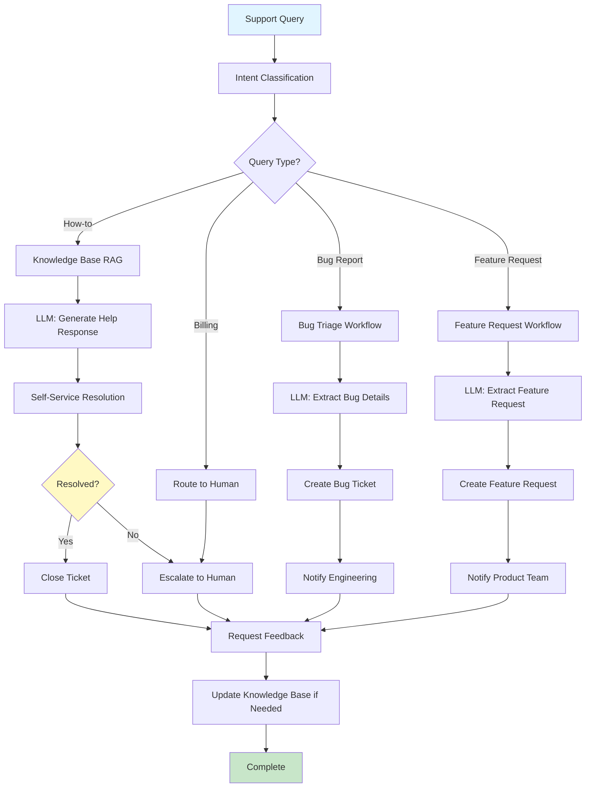

# LLM-Enabled Workflows

## Overview
This document defines the key LLM-enabled workflows for the Universal Blindspot Radar SaaS MVP. Each workflow is expressed as a step-by-step sequence with Mermaid diagrams that specify input triggers, prompt stages, decisions, and validation checkpoints.

---

## Workflow 1: User Onboarding & Setup

### Purpose
Intelligently guide new users through platform setup, tailored to their role and industry.

### Input Triggers
- New user signs up
- User completes account creation

### Workflow Diagram


### Prompt Stages

#### Stage 1: Role-Based Setup Generation
```typescript
const setupPrompt = `
You are an onboarding specialist for compliance software.

USER PROFILE:
- Role: {role}
- Industry: {industry}
- Company Size: {size}
- Goals: {goals}

TASK: Generate a personalized onboarding checklist and configuration recommendations.

OUTPUT FORMAT:
{
  "checklist": [
    {
      "task": "string",
      "reason": "string",
      "priority": "high|medium|low",
      "estimatedTime": "number (minutes)"
    }
  ],
  "recommendedFrameworks": ["string"],
  "suggestedIntegrations": ["string"],
  "quickWins": ["string"]
}
`;
```

#### Stage 2: Industry Context Analysis
```typescript
const industryAnalysisPrompt = `
You are a compliance expert analyzing industry-specific requirements.

INDUSTRY: {industry}
JURISDICTION: {jurisdiction}

TASK: Identify the top 3-5 most relevant compliance frameworks and regulations.

OUTPUT FORMAT:
{
  "frameworks": [
    {
      "name": "string",
      "relevance": "high|medium|low",
      "reason": "string",
      "applicableRegulations": ["string"]
    }
  ]
}
`;
```

### Validation Checkpoints
1. ✓ User profile data is complete
2. ✓ Generated recommendations are relevant to industry
3. ✓ All settings are saved to database
4. ✓ User receives confirmation email

### Data Persistence
- User preferences → `users` table
- Selected frameworks → `user_frameworks` table
- Onboarding progress → `onboarding_state` table

---

## Workflow 2: Intelligent Document Upload & Processing

### Purpose
Automatically extract compliance information from uploaded documents and integrate into knowledge base.

### Input Triggers
- User uploads document(s)
- API document submission

### Workflow Diagram


### Prompt Stages

#### Stage 1: Document Classification
```typescript
const classificationPrompt = `
You are a document classification expert for compliance documents.

DOCUMENT PREVIEW:
{first_1000_chars}

TASK: Classify this document into one of these categories:
- internal_policy
- regulation
- audit_report
- risk_assessment
- procedure
- contract
- other

Also identify:
- Primary topic (e.g., data privacy, financial controls, security)
- Applicable regulations mentioned
- Confidence level

OUTPUT FORMAT (JSON):
{
  "documentType": "string",
  "primaryTopic": "string",
  "regulations": ["string"],
  "confidence": 0.0-1.0,
  "reasoning": "string"
}
`;
```

#### Stage 2: Structured Data Extraction
```typescript
const extractionPrompt = `
You are a compliance data extraction specialist.

DOCUMENT TYPE: {document_type}
FULL DOCUMENT TEXT:
{document_text}

TASK: Extract structured information based on document type.

FOR POLICY DOCUMENTS, EXTRACT:
- Policy name and version
- Effective date and review date
- Owner/responsible party
- Key requirements (list)
- Related regulations
- Affected departments/roles

FOR AUDIT REPORTS, EXTRACT:
- Audit scope and period
- Findings (with severity)
- Recommendations
- Management responses
- Due dates

[Additional type-specific instructions...]

OUTPUT FORMAT (JSON):
{document_type-specific schema}

VALIDATION RULES:
- All dates must be ISO 8601 format
- Confidence scores for each extracted field
- If information is not found, use null (not empty string)
`;
```

#### Stage 3: Summary Generation
```typescript
const summaryPrompt = `
You are creating an executive summary of a compliance document.

DOCUMENT: {document_name}
TYPE: {document_type}
EXTRACTED DATA:
{extracted_data}

TASK: Create a 2-3 sentence summary highlighting:
- What this document is
- Key takeaways
- Why it matters for compliance

Keep it concise and actionable.
`;
```

### Validation Checkpoints
1. ✓ File is valid format (PDF, DOCX, TXT)
2. ✓ Text extraction successful
3. ✓ Classification confidence > 70%
4. ✓ Extracted data matches schema
5. ✓ Embeddings generated successfully
6. ✓ Stored in vector DB
7. ✓ Metadata saved to database

### Data Persistence
- Document metadata → `documents` table
- Extracted entities → `compliance_entities` table
- Document chunks → Vector DB (Pinecone)
- Processing logs → `document_processing_logs` table

---

## Workflow 3: Compliance Query & Answer

### Purpose
Answer user questions about compliance using RAG with retrieved documents.

### Input Triggers
- User submits question in chat interface
- API query request

### Workflow Diagram


### Prompt Stages

#### Stage 1: Query Classification
```typescript
const queryClassificationPrompt = `
Classify this compliance query:

QUERY: {user_query}

CATEGORIES:
- simple_factual: Direct question with straightforward answer
- complex_analysis: Requires multi-step reasoning
- comparison: Comparing multiple items
- status_check: Checking compliance status
- recommendation: Asking for advice

OUTPUT (JSON):
{
  "category": "string",
  "complexity": "low|medium|high",
  "estimated_tokens": number,
  "suggested_model": "gpt-3.5-turbo|gpt-4-turbo"
}
`;
```

#### Stage 2: Response Generation (RAG)
```typescript
const ragPrompt = `
You are an expert compliance advisor with deep knowledge of regulations.

RETRIEVED CONTEXT:
{retrieved_documents}

USER QUESTION:
{user_query}

INSTRUCTIONS:
1. Review the provided context carefully
2. Answer the question based ONLY on the context
3. Include specific citations to source documents
4. If context is insufficient, say so explicitly
5. Provide actionable guidance when appropriate

OUTPUT FORMAT:
## Answer
[Clear, direct answer]

## Details
[Additional relevant information]

## Citations
- [Document name] - [Specific section or page]

## Recommendations (if applicable)
[Actionable next steps]

## Confidence
[High/Medium/Low based on context availability]

IMPORTANT:
- Never make up information not in the context
- Always cite your sources
- If uncertain, express that clearly
`;
```

#### Stage 3: Hallucination Validation
```typescript
const validationPrompt = `
You are a fact-checker validating an AI-generated compliance response.

ORIGINAL QUERY: {query}
AI RESPONSE: {response}
SOURCE DOCUMENTS: {retrieved_docs}

TASK: Check if the response contains any information not supported by the source documents.

For each claim in the response:
1. Identify the claim
2. Find supporting evidence in source documents
3. Rate support level: strong|weak|none

OUTPUT (JSON):
{
  "isValid": boolean,
  "claims": [
    {
      "claim": "string",
      "support": "strong|weak|none",
      "source": "string or null"
    }
  ],
  "hallucinationRisk": "low|medium|high",
  "recommendation": "accept|flag|reject"
}
`;
```

### Validation Checkpoints
1. ✓ Query sanitized (no injection attempts)
2. ✓ Retrieved documents are relevant
3. ✓ Response contains citations
4. ✓ No hallucinations detected
5. ✓ Response meets quality threshold

### Data Persistence
- Query logs → `query_logs` table
- User feedback → `response_feedback` table
- Cached responses → Redis
- Usage metrics → `usage_metrics` table

---

## Workflow 4: Automated Risk Assessment

### Purpose
Generate comprehensive risk assessments from uploaded scenarios or existing data.

### Input Triggers
- User requests risk assessment
- Scheduled periodic assessment
- Significant system change detected

### Workflow Diagram


### Prompt Stages

#### Stage 1: Risk Identification (ReAct)
```typescript
const riskIdentificationPrompt = `
You are a senior risk analyst using the ReAct framework.

SCENARIO:
{scenario_description}

AVAILABLE DATA:
{historical_data}
{compliance_data}
{industry_benchmarks}

TASK: Systematically identify all risks using the ReAct pattern.

Thought 1: [What categories of risk should I consider?]
Action 1: [Examine data category]
Observation 1: [What I found]

Thought 2: [Are there correlated risks?]
Action 2: [Check correlations]
Observation 2: [What I found]

[Continue pattern...]

Final Risk List:
[
  {
    "id": "R-001",
    "category": "string",
    "description": "string",
    "likelihood": 1-5,
    "impact": 1-5,
    "riskScore": calculated,
    "evidence": ["sources"]
  }
]
`;
```

#### Stage 2: Blindspot Detection
```typescript
const blindspotPrompt = `
You are a risk analyst specializing in identifying overlooked risks.

IDENTIFIED RISKS:
{identified_risks}

TASK: Identify potential blindspot risks that are commonly overlooked.

Consider:
- Second-order effects
- Risks at system boundaries
- Emerging risks
- Cultural/organizational risks
- Assumption-based risks

For each blindspot risk:
- Why it's often missed
- How to detect it
- Mitigation strategies

OUTPUT (JSON):
{
  "blindspots": [
    {
      "risk": "string",
      "category": "string",
      "whyMissed": "string",
      "detectionStrategy": "string",
      "likelihood": 1-5,
      "impact": 1-5
    }
  ]
}
`;
```

### Validation Checkpoints
1. ✓ All required data sources available
2. ✓ Risk scores calculated correctly
3. ✓ All risks have evidence
4. ✓ Human reviewer approved
5. ✓ Action items created

### Data Persistence
- Risk assessments → `risk_assessments` table
- Individual risks → `risks` table
- Action items → `action_items` table
- Audit trail → `assessment_history` table

---

## Workflow 5: Automated Report Generation

### Purpose
Generate compliance reports automatically from system data.

### Input Triggers
- User requests report
- Scheduled report generation
- Audit requirement

### Workflow Diagram


### Prompt Chain Stages

#### Chain Stage 1: Data Summary
```typescript
const dataSummaryPrompt = `
Summarize the following compliance data:

DATA:
{compliance_data}
{risk_data}
{audit_data}

OUTPUT (JSON):
{
  "overview": {
    "complianceScore": number,
    "totalRisks": number,
    "highPriorityItems": number,
    "trend": "improving|stable|declining"
  },
  "keyMetrics": [
    {"metric": "string", "value": "string", "change": "string"}
  ],
  "summary": "string (2-3 sentences)"
}
`;
```

#### Chain Stage 2: Analysis
```typescript
const analysisPrompt = `
Given this data summary:
{summary_from_stage_1}

Provide detailed analysis:
1. What are the main findings?
2. What patterns or trends are significant?
3. What are the root causes of issues?
4. How does this compare to previous periods?

OUTPUT (Structured text with sections)
`;
```

#### Chain Stage 3: Recommendations
```typescript
const recommendationsPrompt = `
Based on this analysis:
{analysis_from_stage_2}

Generate actionable recommendations:
- Prioritize by impact and effort
- Provide specific steps
- Suggest timelines
- Identify owners

OUTPUT FORMAT:
{
  "recommendations": [
    {
      "title": "string",
      "description": "string",
      "priority": "high|medium|low",
      "effort": "high|medium|low",
      "timeline": "string",
      "suggestedOwner": "string",
      "expectedImpact": "string"
    }
  ]
}
`;
```

#### Chain Stage 4: Executive Summary
```typescript
const executiveSummaryPrompt = `
Create an executive summary from:

OVERVIEW: {overview}
ANALYSIS: {analysis}
RECOMMENDATIONS: {recommendations}

Requirements:
- Maximum 1 page
- Non-technical language
- Focus on business impact
- Clear call to action

OUTPUT FORMAT:
## Executive Summary

[3-4 paragraphs covering status, key findings, and recommended actions]

## Key Takeaways
- [Bullet point 1]
- [Bullet point 2]
- [Bullet point 3]

## Immediate Actions Required
1. [Action with owner and date]
`;
```

### Validation Checkpoints
1. ✓ All required data extracted
2. ✓ Report sections complete
3. ✓ Visualizations generated
4. ✓ PDF renders correctly
5. ✓ Report stored successfully

### Data Persistence
- Generated reports → `reports` table
- Report metadata → `report_metadata` table
- PDF files → Object storage (S3)
- Generation logs → `report_generation_logs` table

---

## Workflow 6: Customer Support Automation

### Purpose
Automatically handle common customer support queries using LLM.

### Input Triggers
- User submits support ticket
- In-app help query
- Email to support

### Workflow Diagram



### Validation Checkpoints
1. ✓ Query intent correctly classified
2. ✓ Response is relevant and helpful
3. ✓ User confirms resolution OR escalation triggered
4. ✓ Ticket status updated

### Data Persistence
- Support tickets → `support_tickets` table
- Query/response pairs → Training data
- Resolution feedback → `support_feedback` table

---

## Workflow 7: Continuous Compliance Monitoring

### Purpose
Continuously monitor compliance status and alert on changes.

### Input Triggers
- Scheduled: Hourly/Daily checks
- Event-driven: Data changes, new regulations

### Workflow Diagram


---

## Workflow Success Metrics

### Onboarding Workflow
- Time to first value < 10 minutes
- Setup completion rate > 80%
- User satisfaction > 4/5

### Document Processing
- Processing time < 2 minutes per document
- Classification accuracy > 90%
- Extraction accuracy > 85%

### Compliance Query
- Response time < 3 seconds (P95)
- Answer accuracy > 90%
- Citation completeness > 95%
- Cache hit rate > 40%

### Risk Assessment
- Assessment completion time < 5 minutes
- Blindspot detection rate > 3 per assessment
- Human approval rate > 85%

### Report Generation
- Generation time < 1 minute
- Report completeness > 95%
- User satisfaction > 4/5

### Support Automation
- Self-service resolution rate > 60%
- Average response time < 30 seconds
- Escalation rate < 25%

### Compliance Monitoring
- Detection lag < 1 hour
- False positive rate < 10%
- Alert relevance > 85%

---

## Implementation Priority

### Phase 1 (MVP - Week 1-4)
1. ✅ Onboarding Workflow
2. ✅ Document Upload & Processing
3. ✅ Compliance Query & Answer

### Phase 2 (Week 5-8)
4. ✅ Automated Report Generation
5. ✅ Customer Support Automation

### Phase 3 (Week 9-12)
6. ✅ Automated Risk Assessment
7. ✅ Continuous Compliance Monitoring

---

## Next Steps
- See `06-documentation-structure.md` for documentation organization
- See `07-rollout-plan.md` for detailed implementation timeline
