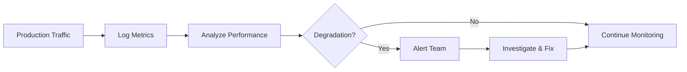
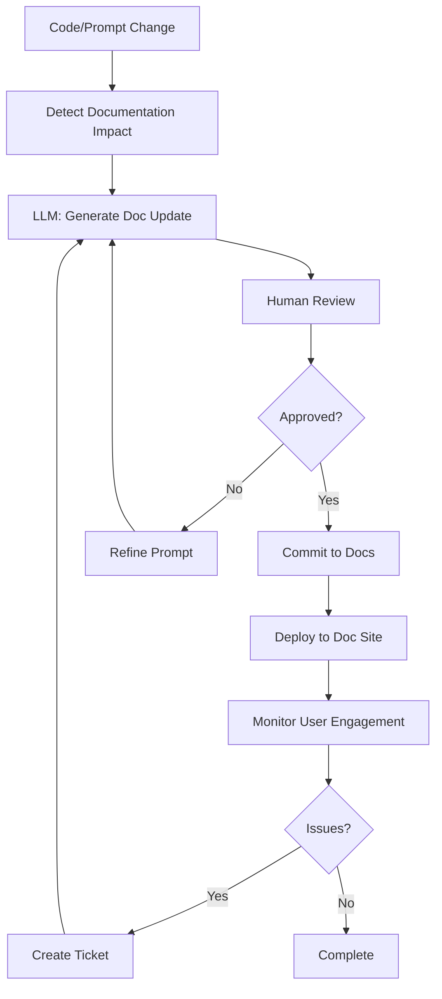

# LLM-Generated Documentation Structure

## Overview
This document defines the structure for LLM-generated documentation, including technical specs, API references, user guides, prompt templates, and decision logs. The goal is to create comprehensive, maintainable documentation that can be partially automated using LLM workflows.

---

## Documentation Architecture

```
docs/
├── llm-strategy/                  # Strategic planning (this directory)
│   ├── 01-personas-and-stakeholders.md
│   ├── 02-prompting-frameworks.md
│   ├── 03-example-prompts.md
│   ├── 04-technology-stack.md
│   ├── 05-llm-workflows.md
│   ├── 06-documentation-structure.md (this file)
│   └── 07-rollout-plan.md
│
├── technical/                     # Technical specifications
│   ├── architecture/
│   │   ├── system-overview.md
│   │   ├── data-flow.md
│   │   ├── security-architecture.md
│   │   └── scalability-plan.md
│   ├── llm-integration/
│   │   ├── model-selection.md
│   │   ├── prompt-engineering.md
│   │   ├── rag-implementation.md
│   │   └── cost-optimization.md
│   └── api/
│       ├── rest-api-spec.yaml
│       ├── graphql-schema.graphql
│       └── webhooks.md
│
├── prompts/                       # Prompt template library
│   ├── README.md
│   ├── templates/
│   │   ├── compliance/
│   │   ├── risk-analysis/
│   │   ├── audit/
│   │   └── support/
│   ├── evaluations/
│   │   └── test-results/
│   └── versions/
│       └── changelog.md
│
├── user-guides/                   # End-user documentation
│   ├── getting-started/
│   │   ├── quickstart.md
│   │   ├── account-setup.md
│   │   └── first-query.md
│   ├── features/
│   │   ├── compliance-queries.md
│   │   ├── risk-assessment.md
│   │   ├── document-management.md
│   │   └── report-generation.md
│   ├── best-practices/
│   │   ├── writing-effective-queries.md
│   │   ├── organizing-documents.md
│   │   └── interpreting-results.md
│   └── troubleshooting/
│       └── common-issues.md
│
├── admin-guides/                  # Administrator documentation
│   ├── deployment/
│   │   ├── installation.md
│   │   ├── configuration.md
│   │   └── upgrades.md
│   ├── operations/
│   │   ├── monitoring.md
│   │   ├── backup-restore.md
│   │   └── security.md
│   └── integrations/
│       ├── sso-setup.md
│       └── api-integration.md
│
├── developer-guides/              # Developer documentation
│   ├── setup/
│   │   ├── local-development.md
│   │   └── testing.md
│   ├── contributing/
│   │   ├── code-style.md
│   │   └── pull-request-process.md
│   └── extending/
│       ├── custom-prompts.md
│       └── plugin-development.md
│
├── decision-logs/                 # Architecture decision records
│   ├── README.md
│   ├── ADR-001-llm-provider-selection.md
│   ├── ADR-002-vector-database-choice.md
│   └── template.md
│
└── release-notes/                 # Version history
    ├── README.md
    └── v1.0.0.md
```

---

## 1. Technical Specifications

### 1.1 System Architecture Document

**Location:** `docs/technical/architecture/system-overview.md`

**LLM Generation Prompt:**
```markdown
Generate a comprehensive system architecture document.

CURRENT STACK:
{technology_stack}

COMPONENTS:
{list_of_components}

INTEGRATIONS:
{external_services}

REQUIREMENTS:
- Include Mermaid architecture diagrams
- Document data flow
- Explain component interactions
- Include scaling considerations
- Document failure modes and recovery

OUTPUT FORMAT:
# System Architecture

## Overview
[High-level description]

## Architecture Diagram
```mermaid
[C4 model diagram]
```

## Components
### [Component Name]
- Purpose
- Technology
- Responsibilities
- APIs
- Dependencies

## Data Flow
[Diagrams and descriptions]

## Scalability
[Scaling strategy]

## Disaster Recovery
[DR plan]
```

**Update Frequency:** Quarterly or on major changes

**Owner:** Tech Lead / Architect

---

### 1.2 LLM Integration Specifications

**Location:** `docs/technical/llm-integration/`

#### 1.2.1 Model Selection Guide

**LLM-Generated Content:**
```markdown
Document current model selection criteria and benchmarks.

INCLUDE:
- Model comparison matrix
- Performance benchmarks
- Cost analysis
- Use case mapping
- Selection flowchart

Update based on:
- New model releases
- Performance test results
- Cost changes
```

#### 1.2.2 Prompt Engineering Guidelines

**Location:** `docs/technical/llm-integration/prompt-engineering.md`

**Content Structure:**
```markdown
# Prompt Engineering Guidelines

## Principles
1. Clarity and specificity
2. Context provision
3. Output formatting
4. Error handling

## Framework Selection
[Decision tree for framework selection]

## Best Practices by Use Case
### Compliance Queries
- Template structure
- Context inclusion
- Citation requirements

### Risk Analysis
- ReAct framework usage
- Data requirements
- Validation steps

## Testing and Validation
- Test case creation
- A/B testing methodology
- Quality metrics

## Anti-Patterns
[Common mistakes to avoid]
```

---

### 1.3 API Documentation

**Location:** `docs/technical/api/`

#### REST API Specification

**Auto-Generated from Code:**
```yaml
# openapi.yaml (generated from code annotations)
openapi: 3.0.0
info:
  title: Universal Blindspot Radar API
  version: 1.0.0
  description: |
    LLM-powered compliance intelligence API
    
paths:
  /api/v1/compliance/query:
    post:
      summary: Query compliance information
      description: |
        Submit a natural language query about compliance status.
        Uses RAG to retrieve relevant documents and LLM to generate response.
      requestBody:
        required: true
        content:
          application/json:
            schema:
              $ref: '#/components/schemas/ComplianceQueryRequest'
      responses:
        '200':
          description: Successful response
          content:
            application/json:
              schema:
                $ref: '#/components/schemas/ComplianceQueryResponse'
              examples:
                gdpr-status:
                  summary: GDPR compliance status query
                  value:
                    query: "What is our GDPR compliance status?"
                    response: "Current GDPR compliance is at 85%..."
                    citations: [...]
                    confidence: 0.92

components:
  schemas:
    ComplianceQueryRequest:
      type: object
      required:
        - query
      properties:
        query:
          type: string
          description: Natural language compliance question
          example: "What is our GDPR Article 32 compliance status?"
        context:
          type: object
          properties:
            industry:
              type: string
            jurisdiction:
              type: string
```

**Generation Strategy:**
- Auto-generate from code using tools like Swagger/OpenAPI generators
- LLM enhances with examples and descriptions
- Manual review for accuracy

---

## 2. Prompt Template Library

### 2.1 Structure

**Location:** `docs/prompts/`

```
prompts/
├── README.md                      # Library overview and usage
├── templates/                     # Organized by use case
│   ├── compliance/
│   │   ├── query-v1.0.0.yaml
│   │   ├── query-v1.1.0.yaml
│   │   └── status-check-v1.0.0.yaml
│   ├── risk-analysis/
│   │   ├── assessment-v1.0.0.yaml
│   │   └── blindspot-detection-v1.0.0.yaml
│   └── support/
│       └── help-response-v1.0.0.yaml
├── evaluations/
│   └── test-results/
│       ├── compliance-query-test-results.json
│       └── risk-analysis-test-results.json
└── versions/
    └── changelog.md
```

### 2.2 Prompt Template Format

**Template Structure (YAML):**
```yaml
---
# Metadata
id: compliance-query-v1.0.0
name: Compliance Query with RAG
version: 1.0.0
created_date: 2026-01-15
last_modified: 2026-01-15
author: AI Team
status: active  # draft | active | deprecated
persona: compliance_officer

# Framework & Configuration
frameworks:
  - RAG
  - Role Prompting
  - Chain-of-Thought

model_config:
  preferred_model: gpt-4-turbo
  fallback_model: gpt-3.5-turbo
  temperature: 0.0
  max_tokens: 2000
  top_p: 1.0

# Performance Metrics
performance:
  accuracy: 0.92
  latency_p95_ms: 2800
  cost_per_request: 0.015
  user_satisfaction: 4.3
  hallucination_rate: 0.02

# Input Variables
input_variables:
  - name: user_query
    type: string
    required: true
    description: User's compliance question
  
  - name: retrieved_documents
    type: array
    required: true
    description: RAG-retrieved context documents
  
  - name: user_role
    type: string
    required: false
    description: User's role for context

# The actual prompt template
template: |
  You are an expert compliance advisor with deep knowledge of industry regulations.
  
  CONTEXT:
  {retrieved_documents}
  
  USER QUESTION:
  {user_query}
  
  INSTRUCTIONS:
  1. Review the provided context carefully
  2. Answer based ONLY on the context provided
  3. Include specific citations to source documents
  4. If information is insufficient, state this clearly
  5. Provide actionable guidance when appropriate
  
  OUTPUT FORMAT:
  ## Answer
  [Direct answer to question]
  
  ## Details
  [Additional relevant information]
  
  ## Citations
  - [Source 1]
  - [Source 2]
  
  ## Recommendations
  [If applicable]

# Validation Rules
validation:
  - rule: must_have_citations
    description: Response must include at least one citation
  - rule: no_hallucination
    description: All claims must be supported by context
  - rule: appropriate_length
    min_tokens: 50
    max_tokens: 1500

# Test Cases
test_cases:
  - name: gdpr_status_query
    input:
      user_query: "What is our GDPR compliance status?"
      retrieved_documents: ["..."]
    expected_output_pattern: "\\d+%.*compliance"
    assertions:
      - contains_citations: true
      - hallucination_score: < 0.1
      - latency_ms: < 3000

# Changelog
changelog:
  - version: 1.0.0
    date: 2026-01-15
    changes: Initial version
    author: AI Team
```

### 2.3 Prompt Evaluation Framework

**Location:** `docs/prompts/evaluations/README.md`

**LLM-Generated Evaluation Rubric:**
```markdown
# Prompt Evaluation Rubric

## Evaluation Criteria

### 1. Accuracy (Weight: 35%)
- Factual correctness
- Alignment with source documents
- Citation accuracy

**Measurement:**
- Human eval on sample (N=100)
- Automated fact-checking
- Citation verification

**Threshold:** > 90%

### 2. Relevance (Weight: 25%)
- Answers the specific question
- Provides useful information
- Appropriate level of detail

**Measurement:**
- Human eval
- Relevance scoring model

**Threshold:** > 85%

### 3. Safety (Weight: 20%)
- No hallucinations
- No harmful content
- Appropriate guardrails

**Measurement:**
- Automated hallucination detection
- Safety classifier
- Human review for critical domains

**Threshold:** 
- Hallucination rate < 5%
- Safety violations: 0

### 4. Performance (Weight: 10%)
- Response latency
- Token efficiency
- Cost per request

**Measurement:**
- P95 latency monitoring
- Token usage tracking
- Cost calculation

**Threshold:**
- P95 latency < 3 seconds
- Cost < $0.05/request

### 5. User Satisfaction (Weight: 10%)
- User ratings
- Follow-up questions
- Task completion

**Measurement:**
- Star ratings
- Feedback surveys
- Analytics

**Threshold:** > 4.0/5.0

## Testing Process

### 1. Unit Testing
Test individual prompt components:
- Input validation
- Output parsing
- Error handling

### 2. Integration Testing
Test full workflow:
- RAG retrieval
- Prompt execution
- Response formatting

### 3. Regression Testing
Ensure changes don't break existing functionality:
- Run test suite on each version
- Compare performance metrics
- Validate edge cases

### 4. A/B Testing
Compare prompt versions in production:
- Split traffic (80/20 or 90/10)
- Track metrics by version
- Statistical significance testing

## Continuous Monitoring



### Key Metrics Dashboard
- Requests per minute
- P50/P95/P99 latency
- Error rate
- Cost per 1K requests
- User satisfaction score
- Hallucination detection rate
```

---

## 3. User Onboarding & Training Guides

### 3.1 Quick Start Guide

**Location:** `docs/user-guides/getting-started/quickstart.md`

**LLM Generation Prompt:**
```
Generate an interactive quick start guide for new users.

TARGET AUDIENCE: {persona}
KEY FEATURES: {features}
TYPICAL USE CASES: {use_cases}

REQUIREMENTS:
- Step-by-step instructions with screenshots
- Interactive elements where possible
- Time estimate for completion
- Links to deeper documentation
- Video walkthrough script

FORMAT:
# 5-Minute Quick Start

⏱️ Estimated time: 5 minutes

## What You'll Learn
- [Goal 1]
- [Goal 2]

## Step 1: [Title]
[Instructions with screenshot]
✅ Checkpoint: [What success looks like]

## Step 2: [Title]
...

## Next Steps
- [Link to advanced features]
- [Link to best practices]

## Need Help?
[Support resources]
```

### 3.2 Feature Documentation

**Auto-Generated from Code:**
```typescript
// Code annotations generate documentation
/**
 * @feature Compliance Query
 * @description Query compliance status using natural language
 * @audience Compliance Officers, Risk Analysts
 * @example
 * ```
 * Input: "What is our GDPR compliance status?"
 * Output: "Current compliance: 85%..."
 * ```
 * @bestPractices
 * - Be specific in your questions
 * - Include relevant context (jurisdiction, date range)
 * - Review citations for accuracy
 * 
 * @troubleshooting
 * - If results seem inaccurate, check uploaded documents
 * - Ensure knowledge base is up to date
 */
export async function complianceQuery(query: string) {
  // Implementation
}
```

**Generated Doc Structure:**
```markdown
# Feature: Compliance Query

## Overview
[Generated from @description]

## Who Should Use This
[Generated from @audience]

## How to Use
[Step-by-step from code flow analysis]

## Examples
[From @example annotations]

## Best Practices
[From @bestPractices]

## Common Issues
[From @troubleshooting]

## Advanced Options
[From parameter documentation]

## Related Features
[Auto-detected from code dependencies]
```

### 3.3 Best Practices Guide

**Location:** `docs/user-guides/best-practices/writing-effective-queries.md`

**LLM-Generated Content:**
```markdown
# Writing Effective Compliance Queries

## Prompt Engineering for End Users

### Principle 1: Be Specific
❌ Bad: "Are we compliant?"
✅ Good: "What is our GDPR Article 32 compliance status for Q1 2026?"

**Why:** Specific queries get more accurate, actionable answers.

### Principle 2: Provide Context
❌ Bad: "What are the requirements?"
✅ Good: "What are the GDPR requirements for data retention in the EU for financial services?"

**Why:** Context helps the AI retrieve the right documents and provide relevant answers.

### Principle 3: Ask One Thing at a Time
❌ Bad: "What's our GDPR, HIPAA, and SOX compliance status and what do we need to fix?"
✅ Good: "What is our GDPR compliance status?" (then follow up with other questions)

**Why:** Complex multi-part questions often get incomplete answers.

### Principle 4: Request Citations
✅ "What is our GDPR compliance status? Please include citations."

**Why:** Citations let you verify the information and dig deeper into sources.

### Principle 5: Iterate and Refine
- Start with a broad question
- Based on the answer, ask follow-up questions
- Dig into specific areas of concern

### Examples by Use Case

#### Checking Compliance Status
Template: "What is our [regulation] compliance status for [time period]?"

Examples:
- "What is our GDPR compliance status for Q4 2025?"
- "What is our SOC 2 compliance status as of today?"

#### Understanding Requirements
Template: "What are the [regulation] requirements for [specific area]?"

Examples:
- "What are the GDPR requirements for data breach notification?"
- "What are the PCI DSS requirements for password management?"

#### Identifying Gaps
Template: "What are the gaps in our compliance with [regulation]?"

Examples:
- "What are the gaps in our HIPAA compliance?"
- "What SOX controls are we missing?"

## Tips for Better Results

### Upload Relevant Documents First
- Company policies
- Audit reports
- Assessment results

### Use the Right Terminology
- Use official regulation names and article numbers
- Be consistent with your industry terminology

### Review Citations
- Always check the sources
- Verify dates and versions
- Flag outdated information

### Provide Feedback
- Rate responses (helps improve the AI)
- Report inaccuracies
- Suggest improvements

## When to Escalate to Human Expert
- Complex legal interpretations
- Novel situations not covered in documents
- High-stakes decisions
- Contradictory information
```

---

## 4. Decision Logs (ADRs)

### 4.1 Architecture Decision Record Template

**Location:** `docs/decision-logs/template.md`

```markdown
# ADR-XXX: [Title]

## Status
[Proposed | Accepted | Rejected | Deprecated | Superseded by ADR-YYY]

## Context
[Describe the problem or opportunity]
[Explain the forces at play (technical, political, social, etc.)]
[Include relevant background information]

## Decision
[Describe the decision that was made]
[Be specific about what was chosen]

## Alternatives Considered

### Alternative 1: [Name]
**Pros:**
- [Benefit 1]
- [Benefit 2]

**Cons:**
- [Drawback 1]
- [Drawback 2]

**Why rejected:** [Reason]

### Alternative 2: [Name]
[Same structure]

## Consequences

### Positive
- [Benefit 1]
- [Benefit 2]

### Negative
- [Trade-off 1]
- [Trade-off 2]

### Neutral
- [Other implication 1]

## Implementation Notes
[Specific details about how to implement]
[Configuration required]
[Migration path if applicable]

## Validation
[How will we know if this decision was correct?]
[Metrics to track]
[Review date]

## References
- [Link to relevant documents]
- [Link to research]
- [Link to discussions]

## Metadata
- **Date:** YYYY-MM-DD
- **Author(s):** [Names]
- **Stakeholders:** [Who was consulted]
- **Review Date:** YYYY-MM-DD
```

### 4.2 Example ADR

**Location:** `docs/decision-logs/ADR-001-llm-provider-selection.md`

```markdown
# ADR-001: Primary LLM Provider Selection

## Status
Accepted (2026-01-15)

## Context
We need to select a primary LLM provider for our SaaS MVP. The system will make 10K-100K API calls per month initially, scaling to 1M+ calls as we grow.

Requirements:
- High accuracy for compliance and risk domains
- Reliable uptime (99.9%+)
- Reasonable cost
- Good developer experience
- Strong safety features

## Decision
We will use **OpenAI (GPT-4-turbo as primary, GPT-3.5-turbo for simple queries)** as our primary LLM provider, with **Anthropic Claude Sonnet** as a fallback.

## Alternatives Considered

### Alternative 1: Anthropic Claude Only
**Pros:**
- Excellent safety features (Constitutional AI)
- 200K context window
- Strong performance on analytical tasks

**Cons:**
- Less mature ecosystem
- Fewer integrations
- Higher cost for high-volume usage

**Why not chosen:** While excellent, ecosystem maturity favored OpenAI for MVP

### Alternative 2: Open Source (Llama 2/Mixtral via HuggingFace)
**Pros:**
- Lower cost at scale
- Data stays in-house
- Full control

**Cons:**
- Infrastructure complexity
- Latency challenges
- Accuracy concerns for specialized domain
- Requires ML expertise

**Why not chosen:** Too much complexity for MVP; reconsider post-PMF

### Alternative 3: Multi-Provider from Start
**Pros:**
- Reduced vendor lock-in
- Can optimize cost by routing

**Cons:**
- Integration complexity
- Harder to debug issues
- Prompt inconsistencies

**Why not chosen:** Premature optimization; will implement after MVP

## Consequences

### Positive
- Battle-tested provider with excellent reliability
- Rich ecosystem (LangChain, LlamaIndex native support)
- Strong documentation and community
- Easy to hire developers familiar with platform
- Function calling support for structured outputs

### Negative
- Vendor lock-in risk
- Cost can scale quickly
- Data sent to third party (privacy concerns for sensitive data)
- Rate limits may constrain growth

### Mitigation
- Abstract LLM calls behind interface for future provider swapping
- Implement aggressive caching to reduce costs
- Use Claude fallback for redundancy
- Implement Azure OpenAI for enterprise customers with data residency needs

## Implementation Notes

### Configuration
```typescript
// config/llm.ts
export const llmConfig = {
  primary: {
    provider: 'openai',
    model: 'gpt-4-turbo',
    apiKey: process.env.OPENAI_API_KEY,
  },
  secondary: {
    provider: 'anthropic',
    model: 'claude-sonnet-3',
    apiKey: process.env.ANTHROPIC_API_KEY,
  },
  routing: {
    simple_queries: 'gpt-3.5-turbo',  // Cost optimization
    complex_analysis: 'gpt-4-turbo',
    sensitive_data: 'claude-sonnet-3', // Better safety
  },
};
```

### Cost Management
- Set budget alerts at $500, $1000, $2000/month
- Monitor cost per request
- Review highest-cost endpoints monthly

## Validation

### Success Metrics
- API uptime > 99.9%
- P95 latency < 3 seconds
- Cost per request < $0.05
- User satisfaction > 4/5

### Review
- Review monthly for first 3 months
- Full reassessment at 6 months or 100K users
- Reconsider open source at 1M+ users

## References
- OpenAI Pricing: https://openai.com/pricing
- Anthropic Pricing: https://www.anthropic.com/pricing
- LLM Comparison Benchmark: [Internal document]
- Cost Analysis Spreadsheet: [Internal link]

## Metadata
- **Date:** 2026-01-15
- **Author:** AI Team Lead
- **Stakeholders:** CTO, Product Manager, Engineering Team
- **Next Review:** 2026-04-15
```

---

## 5. Version History & Release Notes

### 5.1 Release Notes Template

**Location:** `docs/release-notes/vX.Y.Z.md`

**LLM-Enhanced Generation:**
```markdown
# Release Notes v1.2.0

**Release Date:** 2026-02-15  
**Type:** Minor Release

## 🎉 Highlights

[AI-generated summary of major features and improvements]

## ✨ New Features

### Compliance Query Enhancement
- Added support for multi-jurisdiction queries
- Improved citation accuracy by 15%
- [More details](#feature-compliance-query)

### Risk Assessment Automation
- Automated blindspot detection
- Risk correlation matrix
- [More details](#feature-risk-assessment)

## 🐛 Bug Fixes

- Fixed: Incorrect date formatting in reports (#123)
- Fixed: Cache invalidation issue (#145)
- [See all bug fixes](#bug-fixes)

## 🚀 Improvements

- Reduced query latency by 30% (P95: 2.1s → 1.5s)
- Improved RAG retrieval relevance (+12%)
- Enhanced error messages

## ⚠️ Breaking Changes

**None in this release**

## 📝 Prompt Template Updates

### Updated
- `compliance-query-v1.1.0` → `v1.2.0`
  - Added multi-jurisdiction support
  - Improved citation formatting

### Deprecated
- `risk-assessment-v1.0.0` (use v1.1.0 instead)

## 🔒 Security

- Updated dependencies to patch CVE-2026-1234
- Enhanced input sanitization

## 📊 Performance

| Metric | Previous | Current | Change |
|--------|----------|---------|--------|
| P95 Latency | 2.1s | 1.5s | -29% |
| Accuracy | 89% | 92% | +3% |
| Cost/Request | $0.018 | $0.015 | -17% |

## 🔄 Migration Guide

No migrations required for this release.

## 📚 Documentation Updates

- New guide: Writing Effective Queries
- Updated: API Reference for new endpoints
- Added: Multi-jurisdiction Query Examples

## 🙏 Contributors

- [List of contributors]

## 📅 What's Next (v1.3.0)

- Automated report scheduling
- Mobile app (beta)
- Advanced analytics dashboard

---

## Detailed Changes

### Feature: Compliance Query Enhancement {#feature-compliance-query}

**Motivation:**
Users requested ability to query compliance across multiple jurisdictions simultaneously.

**Implementation:**
- Added `jurisdictions` array to query input
- Enhanced RAG to retrieve jurisdiction-specific documents
- Updated prompt template to handle multi-jurisdiction context

**Example:**
```json
{
  "query": "What is our GDPR and CCPA compliance status?",
  "jurisdictions": ["EU", "California"]
}
```

**Impact:**
- Reduces query time for multi-jurisdiction compliance
- Improves user efficiency

[Continue with more detailed sections...]
```

---

## 6. Documentation Maintenance

### 6.1 LLM-Assisted Documentation Updates

**Workflow:**
1. **Code Changes Trigger Doc Updates**
   ```yaml
   # .github/workflows/doc-update.yml
   on:
     pull_request:
       paths:
         - 'src/api/**'
         - 'src/prompts/**'
   
   jobs:
     update-docs:
       runs-on: ubuntu-latest
       steps:
         - name: Analyze code changes
         - name: Generate doc updates via LLM
         - name: Create PR for doc updates
   ```

2. **Periodic Documentation Review**
   - Monthly: Review all docs for accuracy
   - Quarterly: Major documentation refresh
   - On each release: Update version-specific docs

3. **User Feedback Integration**
   - Collect feedback on documentation
   - LLM analyzes feedback and suggests improvements
   - Human review and approval

### 6.2 Documentation Quality Metrics

Track and improve documentation quality:

```markdown
## Documentation Health Dashboard

### Coverage
- API endpoints documented: 98% ✅
- Prompt templates documented: 100% ✅
- Features with user guides: 85% ⚠️

### Freshness
- Docs updated in last 30 days: 45%
- Docs over 90 days old: 12% ⚠️
- Broken links: 3 🔴

### Engagement
- Most viewed pages:
  1. Quick Start Guide (2.3K views/month)
  2. API Reference (1.8K views/month)
  3. Troubleshooting (1.2K views/month)
  
- Average time on page: 3m 45s
- Bounce rate: 28%

### Quality
- User ratings: 4.2/5 ✅
- Support tickets due to docs: 15% (↓3% from last month)
- Doc feedback submissions: 23/month

### Action Items
- [ ] Update "Advanced Risk Analysis" guide (96 days old)
- [ ] Fix broken links in API docs
- [ ] Create missing guide for "Report Scheduling"
```

---

## 7. Documentation Automation Strategy

### 7.1 What to Automate

**✅ Good Candidates for LLM Generation:**
- API reference from code annotations
- Prompt template documentation
- Release notes (draft)
- Code examples
- Migration guides
- FAQ updates based on support tickets
- Troubleshooting guides from error logs

**❌ Keep Human-Written:**
- Strategic decisions (ADRs)
- Architecture overviews
- Security guidelines
- Legal/compliance disclaimers
- Critical user safety information

### 7.2 LLM Documentation Workflow



---

## Next Steps
- See `07-rollout-plan.md` for implementation timeline and milestones
