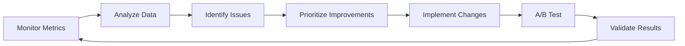

# Strategic Rollout Plan & Summary

## Executive Summary

This document provides a comprehensive rollout plan for the Universal Blindspot Radar LLM-powered SaaS MVP, including:
- Prompting framework recommendations mapped to personas
- Critical tooling selections
- Essential workflows with success criteria
- Phased implementation timeline with milestones
- Best practices for production deployment

---

## 1. Strategic Overview

### Vision
Build an AI-native compliance intelligence platform that leverages LLM reasoning and RAG to help organizations identify and mitigate compliance blindspots proactively.

### Core Value Propositions
1. **Intelligent Query**: Natural language compliance questions with evidence-based answers
2. **Automated Risk Assessment**: AI-powered identification of hidden risks and blindspots
3. **Smart Document Processing**: Automatic extraction and analysis of compliance documents
4. **Proactive Monitoring**: Continuous compliance status tracking with intelligent alerts
5. **Rapid Report Generation**: Automated, customizable compliance reports

### Success Metrics (6-Month Targets)
- **Adoption:** 500+ active organizations
- **Engagement:** 10K+ queries per month
- **Satisfaction:** 4.2/5 average user rating
- **Accuracy:** >90% response accuracy
- **Performance:** <3s P95 query latency
- **Cost Efficiency:** <$0.05 per query

---

## 2. Persona-Framework Mapping Summary

### External Stakeholders

| Persona | Primary Frameworks | Key Value | Priority |
|---------|-------------------|-----------|----------|
| **Compliance Officer** | RAG + Role + CoT | Evidence-based answers with citations | **P0** |
| **Risk Analyst** | ReAct + CoT + ToT | Systematic risk identification & analysis | **P0** |
| **Industry Consultant** | Role + RAG + Few-Shot | Professional, client-ready outputs | **P1** |
| **Auditor** | RAG + Self-Consistency | High-accuracy verification with evidence | **P1** |
| **Executive Sponsor** | Prompt Chain + Role | Strategic insights, executive summaries | **P0** |

### Internal Stakeholders

| Persona | Primary Frameworks | Key Value | Priority |
|---------|-------------------|-----------|----------|
| **Product Manager** | ToT + ReAct | Multi-option evaluation, decision support | **P0** |
| **ML/AI Engineer** | ReAct + Chain | Technical optimization & debugging | **P0** |
| **DevOps Engineer** | ReAct + Role | Incident response, cost monitoring | **P0** |
| **QA Engineer** | Few-Shot + Self-Consistency | Consistent testing, quality assurance | **P1** |
| **Data Engineer** | ReAct + Chain | Pipeline design, data quality | **P1** |
| **Customer Success** | Role + RAG | Helpful, accurate customer support | **P1** |
| **Security Engineer** | CoT + ReAct | Threat analysis, vulnerability detection | **P0** |

**Priority Definitions:**
- **P0:** MVP critical - must have for launch
- **P1:** Important - target for first 2 months post-launch
- **P2:** Nice to have - future enhancement

---

## 3. Critical Tooling Stack

### Core Technology Stack

#### LLM & AI Layer (P0)
```yaml
Primary LLM: OpenAI
  - Models: GPT-4-turbo, GPT-3.5-turbo
  - Justification: Best ecosystem, reliability, accuracy
  - Cost: ~$100-500/month initially

Fallback LLM: Anthropic Claude
  - Models: Claude Sonnet
  - Use Cases: Safety-critical, long-context
  
Orchestration: LangChain
  - Version: 0.1.x+ (TypeScript)
  - Justification: Mature, extensive integrations

Prompt Management: LangSmith
  - Purpose: Versioning, testing, monitoring
  - Cost: Free tier initially

Monitoring: Helicone
  - Purpose: Cost tracking, caching, analytics
  - Cost: Free tier initially
```

#### Vector & Data Layer (P0)
```yaml
Vector Database: Pinecone
  - Justification: Managed, zero-ops, excellent performance
  - Cost: Free tier (1 pod)

Primary Database: PostgreSQL 16
  - Extensions: pgvector (backup vector search)
  - Hosting: Railway/Vercel Postgres

Cache: Redis (Upstash)
  - Use Cases: LLM response caching, rate limiting
  - Cost: Free tier initially

Embeddings: OpenAI text-embedding-3-large
  - Cost: $0.13 per 1M tokens
```

#### Backend & API (P0)
```yaml
Runtime: Node.js 20+
Framework: Express or Fastify
API Type: tRPC (type-safe RPC)
ORM: Prisma
Validation: Zod
```

#### Frontend (P0)
```yaml
Framework: React 19 + TypeScript
Styling: Tailwind CSS + shadcn/ui
State Management: TanStack Query
Routing: React Router
```

#### Auth & Billing (P0)
```yaml
Authentication: Clerk
  - Features: Email, SSO, MFA
  - Cost: Free up to 10K MAU

Billing: Stripe
  - Use Cases: Subscriptions, usage-based billing
```

#### Infrastructure (P0)
```yaml
Frontend Hosting: Vercel
Backend Hosting: Railway or Render
CI/CD: GitHub Actions
Monitoring: Sentry (errors) + Helicone (LLM)
```

### Tooling Budget (Monthly)

| Service | Initial | Scale (1K users) | Scale (10K users) |
|---------|---------|------------------|-------------------|
| Vercel | $20 | $20 | $50 |
| Railway/Render | $5-25 | $50 | $200 |
| OpenAI API | $100-500 | $1K-2K | $5K-10K |
| Pinecone | $0 | $70 | $200 |
| Clerk | $0 | $25 | $99 |
| Monitoring | $0 | $50 | $150 |
| **Total** | **$125-545** | **$1.2K-2.2K** | **$5.7K-10.7K** |

---

## 4. Essential Workflows

### Phase 1: MVP Core (Weeks 1-4)

#### Workflow 1: User Onboarding ✅
**Description:** Intelligent, role-based onboarding
**Success Criteria:**
- Time to first value: <10 minutes
- Completion rate: >80%
- User satisfaction: >4/5

**Implementation Steps:**
1. Week 1: Design onboarding flow
2. Week 1: Implement role detection
3. Week 2: Build LLM prompts for personalization
4. Week 2: Create UI components
5. Week 3: Integration testing
6. Week 4: A/B test and optimize

#### Workflow 2: Document Upload & Processing ✅
**Description:** Automated document analysis and knowledge base population
**Success Criteria:**
- Processing time: <2 minutes per document
- Classification accuracy: >90%
- Extraction accuracy: >85%

**Implementation Steps:**
1. Week 1: File upload infrastructure
2. Week 2: Document classification prompts
3. Week 2: Structured extraction prompts
4. Week 3: Embedding generation pipeline
5. Week 3: Vector DB integration
6. Week 4: Testing and optimization

#### Workflow 3: Compliance Query & Answer ✅
**Description:** RAG-powered compliance questions with citations
**Success Criteria:**
- Response time: <3s (P95)
- Answer accuracy: >90%
- Citation completeness: >95%
- Cache hit rate: >40%

**Implementation Steps:**
1. Week 1: RAG infrastructure (retrieval)
2. Week 2: Query classification
3. Week 2: Response generation prompts
4. Week 3: Hallucination validation
5. Week 3: Caching implementation
6. Week 4: Performance optimization

### Phase 2: Extended Features (Weeks 5-8)

#### Workflow 4: Automated Report Generation ✅
**Description:** Generate compliance reports from system data
**Success Criteria:**
- Generation time: <1 minute
- Report completeness: >95%
- User satisfaction: >4/5

**Implementation Steps:**
1. Week 5: Report templates
2. Week 5-6: Prompt chain development
3. Week 6: Data aggregation
4. Week 7: Visualization generation
5. Week 7: PDF generation
6. Week 8: Testing and polish

#### Workflow 5: Customer Support Automation ✅
**Description:** AI-powered support ticket handling
**Success Criteria:**
- Self-service resolution: >60%
- Response time: <30 seconds
- Escalation rate: <25%

**Implementation Steps:**
1. Week 5: Intent classification
2. Week 6: Knowledge base RAG
3. Week 6: Response generation
4. Week 7: Escalation logic
5. Week 8: Integration with ticketing system

### Phase 3: Advanced Features (Weeks 9-12)

#### Workflow 6: Automated Risk Assessment ✅
**Description:** Comprehensive risk analysis with blindspot detection
**Success Criteria:**
- Assessment completion: <5 minutes
- Blindspot detection: >3 per assessment
- Human approval rate: >85%

**Implementation Steps:**
1. Week 9: Risk identification prompts (ReAct)
2. Week 9: Cascading risk analysis
3. Week 10: Blindspot detection prompts
4. Week 10: Risk scoring algorithms
5. Week 11: Recommendation generation
6. Week 12: Testing and validation

#### Workflow 7: Continuous Compliance Monitoring ✅
**Description:** Real-time compliance status tracking
**Success Criteria:**
- Detection lag: <1 hour
- False positive rate: <10%
- Alert relevance: >85%

**Implementation Steps:**
1. Week 11: Change detection system
2. Week 11: Impact analysis prompts
3. Week 12: Alert generation
4. Week 12: Dashboard integration

---

## 5. Best Practices Implementation

### 5.1 Prompt Versioning & Testing

**Strategy:**
```yaml
Versioning:
  - Use semantic versioning (MAJOR.MINOR.PATCH)
  - Store prompts in database with version metadata
  - Track in Git for review and history
  - Document changes in changelog

Testing:
  - Unit tests for prompt templates
  - Integration tests for workflows
  - Regression tests on each change
  - A/B tests for new versions

Deployment:
  - Gradual rollout (10% → 50% → 100%)
  - Monitor key metrics during rollout
  - Automatic rollback on degradation
  - Human review for critical prompts
```

**Implementation:**
```typescript
// Example: Versioned prompt deployment
interface PromptVersion {
  id: string;
  version: string;
  status: 'draft' | 'testing' | 'active' | 'deprecated';
  rolloutPercentage: number;
  metrics: {
    accuracy: number;
    latency: number;
    cost: number;
    satisfaction: number;
  };
}

async function getPromptForUser(templateId: string, userId: string): Promise<string> {
  // A/B testing logic
  const versions = await getActiveVersions(templateId);
  const version = selectVersionForUser(versions, userId);
  return version.template;
}
```

### 5.2 Validation & Hallucination Mitigation

**Multi-Layer Validation:**

```typescript
// Layer 1: Input Sanitization
function sanitizeInput(input: string): string {
  // Remove potential injection attempts
  // Validate length
  // Check for malicious patterns
  return sanitized;
}

// Layer 2: RAG Quality Check
function validateRetrievalQuality(query: string, docs: Document[]): boolean {
  // Check relevance scores
  // Ensure minimum number of relevant docs
  // Validate doc freshness
  return isGoodEnough;
}

// Layer 3: Response Validation
async function validateResponse(response: string, context: string[]): Promise<ValidationResult> {
  // Citation verification
  const citationsValid = verifyCitations(response, context);
  
  // Contradiction detection
  const contradictions = await detectContradictions(response, context);
  
  // Confidence scoring
  const confidence = await calculateConfidence(response);
  
  return {
    isValid: citationsValid && contradictions.length === 0 && confidence > 0.7,
    issues: [...],
  };
}

// Layer 4: Self-Consistency Check
async function selfConsistencyCheck(prompt: string, n: number = 3): Promise<string> {
  // Generate N independent responses
  const responses = await Promise.all(
    Array(n).fill(null).map(() => generateResponse(prompt))
  );
  
  // Find consensus
  const consensus = findConsensusAnswer(responses);
  return consensus;
}
```

**Guardrails:**
```typescript
const GUARDRAILS = {
  // Input validation
  maxInputLength: 10000,
  forbiddenPatterns: [/ignore.*instructions/i, /system.*prompt/i],
  
  // Output validation
  requireCitations: true,
  maxOutputLength: 5000,
  forbiddenContent: ['personally identifiable', 'financial data'],
  
  // Performance limits
  maxLatency: 5000, // ms
  maxCost: 0.10, // dollars per request
  
  // Safety
  hallucination_threshold: 0.1,
  confidence_threshold: 0.7,
};
```

### 5.3 Context Layering & RAG Optimization

**Context Strategy:**
```typescript
interface ContextLayer {
  system: string;      // System-level instructions (role, format)
  domain: string;      // Domain knowledge (regulations, standards)
  organizational: string; // Org-specific (policies, history)
  retrieved: Document[]; // RAG-retrieved relevant docs
  user: string;        // User context (role, preferences)
}

async function buildContext(query: string, user: User): Promise<ContextLayer> {
  return {
    system: getSystemPrompt(query.type),
    domain: await getDomainKnowledge(query.domain),
    organizational: await getOrgContext(user.organizationId),
    retrieved: await retrieveDocuments(query, user),
    user: getUserContext(user),
  };
}

function constructPrompt(query: string, context: ContextLayer): string {
  return `
${context.system}

DOMAIN KNOWLEDGE:
${context.domain}

ORGANIZATIONAL CONTEXT:
${context.organizational}

RETRIEVED DOCUMENTS:
${context.retrieved.map(d => d.content).join('\n\n')}

USER: ${context.user}
QUERY: ${query}
`;
}
```

**RAG Optimization:**
```typescript
// Hybrid search: Vector + Keyword
async function retrieveDocuments(query: string, options: RetrievalOptions) {
  // Vector search
  const vectorResults = await vectorDB.search({
    vector: await embed(query),
    topK: 10,
    filters: options.filters,
  });
  
  // Keyword search
  const keywordResults = await fullTextSearch(query, options);
  
  // Combine and re-rank
  const combined = combineResults(vectorResults, keywordResults);
  const reranked = await rerankResults(combined, query);
  
  return reranked.slice(0, options.topK || 5);
}

// Chunking strategy
const CHUNKING_CONFIG = {
  chunkSize: 1000, // tokens
  chunkOverlap: 200,
  separators: ['\n\n', '\n', '. ', ' '],
  preserveStructure: true, // Keep headings, lists together
};

// Embedding cache
async function getEmbedding(text: string): Promise<number[]> {
  const cacheKey = hash(text);
  const cached = await redis.get(`embedding:${cacheKey}`);
  if (cached) return JSON.parse(cached);
  
  const embedding = await openai.embeddings.create({
    model: 'text-embedding-3-large',
    input: text,
  });
  
  await redis.setex(`embedding:${cacheKey}`, 86400, JSON.stringify(embedding));
  return embedding.data[0].embedding;
}
```

### 5.4 Roles & Permissions for Prompt Editing

**RBAC for Prompts:**
```typescript
enum PromptPermission {
  VIEW = 'prompt:view',
  EDIT_DRAFT = 'prompt:edit_draft',
  PUBLISH = 'prompt:publish',
  DEPRECATE = 'prompt:deprecate',
  DELETE = 'prompt:delete',
}

const ROLE_PERMISSIONS = {
  ADMIN: [/* all permissions */],
  AI_ENGINEER: [
    PromptPermission.VIEW,
    PromptPermission.EDIT_DRAFT,
    PromptPermission.PUBLISH,
  ],
  PRODUCT_MANAGER: [
    PromptPermission.VIEW,
    PromptPermission.EDIT_DRAFT,
  ],
  VIEWER: [
    PromptPermission.VIEW,
  ],
};

// Approval workflow for critical prompts
interface PromptApproval {
  promptId: string;
  version: string;
  requestedBy: string;
  approvers: string[];
  status: 'pending' | 'approved' | 'rejected';
  testResults: TestResults;
  impactAssessment: string;
}

async function publishPrompt(promptId: string, version: string, user: User) {
  // Check permission
  if (!user.hasPermission(PromptPermission.PUBLISH)) {
    throw new Error('Unauthorized');
  }
  
  // For critical prompts, require approval
  if (await isCriticalPrompt(promptId)) {
    return await requestApproval(promptId, version, user);
  }
  
  // Run final tests
  const testResults = await runPromptTests(promptId, version);
  if (!testResults.passed) {
    throw new Error('Tests failed');
  }
  
  // Gradual rollout
  await deployWithGradualRollout(promptId, version);
}
```

### 5.5 Performance & Cost Optimization

**Caching Strategy:**
```typescript
// Multi-level caching
class LLMCache {
  // L1: In-memory (fastest, smallest)
  private memoryCache = new Map<string, CacheEntry>();
  
  // L2: Redis (fast, larger)
  private redis: Redis;
  
  // L3: Semantic cache (similar queries)
  private semanticCache: SemanticCache;
  
  async get(prompt: string, options: CacheOptions): Promise<string | null> {
    // Exact match (L1)
    const exactKey = this.hash(prompt);
    if (this.memoryCache.has(exactKey)) {
      return this.memoryCache.get(exactKey)!.response;
    }
    
    // Exact match (L2)
    const redisResult = await this.redis.get(`llm:${exactKey}`);
    if (redisResult) return redisResult;
    
    // Semantic match (L3)
    if (options.allowSemantic) {
      const similar = await this.semanticCache.findSimilar(prompt, 0.95);
      if (similar) return similar.response;
    }
    
    return null;
  }
  
  async set(prompt: string, response: string, ttl: number = 3600) {
    const key = this.hash(prompt);
    
    // L1
    this.memoryCache.set(key, { response, timestamp: Date.now() });
    
    // L2
    await this.redis.setex(`llm:${key}`, ttl, response);
    
    // L3
    await this.semanticCache.add(prompt, response);
  }
}
```

**Cost Optimization:**
```typescript
// Model routing based on complexity
async function routeToModel(query: string): Promise<ModelConfig> {
  const complexity = await assessComplexity(query);
  
  if (complexity.score < 0.3) {
    return {
      model: 'gpt-3.5-turbo',
      cost: 0.0015,
      expectedLatency: 1000,
    };
  } else if (complexity.score < 0.7) {
    return {
      model: 'gpt-4-turbo',
      cost: 0.01,
      expectedLatency: 2000,
    };
  } else {
    return {
      model: 'gpt-4-turbo',
      temperature: 0,  // More focused for complex
      cost: 0.015,
      expectedLatency: 3000,
    };
  }
}

// Budget enforcement
class CostTracker {
  async checkBudget(userId: string, estimatedCost: number): Promise<boolean> {
    const usage = await this.getMonthlyUsage(userId);
    const limit = await this.getUserLimit(userId);
    
    if (usage + estimatedCost > limit) {
      await this.notifyBudgetExceeded(userId);
      return false;
    }
    
    return true;
  }
  
  async trackCost(userId: string, cost: number, metadata: any) {
    await db.usageLog.create({
      userId,
      cost,
      timestamp: new Date(),
      metadata,
    });
  }
}

// Batch processing
async function batchProcess(queries: string[]): Promise<string[]> {
  // Group similar queries
  const groups = groupSimilarQueries(queries);
  
  // Process each group with shared context
  const results = await Promise.all(
    groups.map(async (group) => {
      const sharedContext = await getSharedContext(group);
      return await processGroup(group, sharedContext);
    })
  );
  
  return results.flat();
}
```

---

## 6. Implementation Timeline

### Pre-Launch (Week -2 to 0)
- [ ] Infrastructure setup (Vercel, Railway, databases)
- [ ] Auth & billing integration
- [ ] Basic monitoring setup
- [ ] Core data models
- [ ] Development environment

### Phase 1: MVP Core (Weeks 1-4) 🎯

**Week 1: Foundation**
- [ ] User onboarding flow design
- [ ] Document upload infrastructure
- [ ] RAG pipeline setup (embedding, vector DB)
- [ ] Basic prompt templates

**Week 2: Core Features**
- [ ] Onboarding LLM integration
- [ ] Document classification & extraction
- [ ] Compliance query infrastructure
- [ ] Initial UI components

**Week 3: Integration**
- [ ] End-to-end workflow testing
- [ ] Hallucination validation
- [ ] Caching implementation
- [ ] Error handling

**Week 4: Polish & Launch Prep**
- [ ] Performance optimization
- [ ] A/B testing setup
- [ ] Documentation
- [ ] Beta user testing
- [ ] **Launch MVP to first 50 users**

### Phase 2: Extended Features (Weeks 5-8)

**Week 5-6: Reports & Support**
- [ ] Report generation prompts
- [ ] Support automation (intent classification)
- [ ] Knowledge base RAG
- [ ] Dashboard enhancements

**Week 7-8: Refinement**
- [ ] Report templates & customization
- [ ] Support ticket integration
- [ ] Performance improvements
- [ ] User feedback incorporation
- [ ] **Scale to 200 users**

### Phase 3: Advanced Features (Weeks 9-12)

**Week 9-10: Risk & Monitoring**
- [ ] Risk assessment workflows
- [ ] Blindspot detection prompts
- [ ] Compliance monitoring system
- [ ] Alert infrastructure

**Week 11-12: Enterprise Readiness**
- [ ] SSO support
- [ ] Advanced RBAC
- [ ] Audit logging
- [ ] Custom branding
- [ ] **Scale to 500 users**

### Phase 4: Growth & Optimization (Months 4-6)

**Focus Areas:**
- Performance at scale
- Cost optimization
- Feature refinement based on usage
- Enterprise features
- International expansion
- Mobile app (if validated)

---

## 7. Success Criteria & KPIs

### Product Metrics

#### Adoption
- **Week 4:** 50 active users
- **Week 8:** 200 active users
- **Week 12:** 500 active users
- **Month 6:** 2,000 active users

#### Engagement
- Daily active users / Monthly active users: >30%
- Queries per user per month: >20
- Documents uploaded per user: >10
- Feature adoption rate: >60% for core features

#### Satisfaction
- User satisfaction score (CSAT): >4.0/5.0
- Net Promoter Score (NPS): >40
- Support ticket rate: <5% of users
- Churn rate: <5% monthly

### Technical Metrics

#### Performance
- P95 query latency: <3 seconds
- System uptime: >99.9%
- Error rate: <0.1%
- Cache hit rate: >40%

#### Quality
- Response accuracy: >90%
- Citation completeness: >95%
- Hallucination rate: <5%
- User-reported accuracy issues: <2%

#### Cost
- Cost per query: <$0.05
- Infrastructure cost per user: <$5/month
- LLM cost as % of revenue: <30%

### Business Metrics

#### Revenue
- Month 3: $5K MRR
- Month 6: $25K MRR
- Month 12: $100K MRR

#### Conversion
- Free to paid conversion: >15%
- Trial to paid conversion: >40%
- Time to first value: <10 minutes

---

## 8. Risk Mitigation

### Technical Risks

| Risk | Probability | Impact | Mitigation |
|------|-------------|--------|------------|
| LLM hallucinations | High | High | Multi-layer validation, self-consistency checks, human review for critical decisions |
| API rate limits | Medium | High | Implement caching, request queuing, fallback providers |
| Cost overruns | High | Medium | Budget alerts, cost tracking, model routing, aggressive caching |
| Poor RAG relevance | Medium | High | Hybrid search, re-ranking, continuous evaluation, user feedback loop |
| Slow response times | Medium | Medium | Caching, model selection, infrastructure scaling |

### Business Risks

| Risk | Probability | Impact | Mitigation |
|------|-------------|--------|------------|
| Low adoption | Medium | High | Beta program, user research, iterative improvement |
| Compliance issues | Low | Critical | Legal review, SOC 2 compliance, security audits |
| Competition | High | Medium | Differentiation on blindspot detection, fast iteration |
| Data quality | Medium | High | Document validation, user feedback, data quality checks |

---

## 9. Go/No-Go Criteria

### Launch Criteria (Week 4)
- [ ] All P0 workflows implemented and tested
- [ ] Core prompts achieve >80% accuracy
- [ ] P95 latency <5 seconds
- [ ] Security review completed
- [ ] 10 beta users successfully onboarded
- [ ] Cost per query <$0.10
- [ ] Documentation complete
- [ ] Support processes in place

### Scale Criteria (Month 3)
- [ ] System handles 1K queries/day
- [ ] User satisfaction >4.0/5.0
- [ ] Churn rate <10%
- [ ] Cost per query <$0.05
- [ ] Automated monitoring in place
- [ ] Incident response tested

---

## 10. Post-Launch Activities

### Continuous Improvement Loop



### Weekly Rituals
- **Monday:** Review week metrics, prioritize improvements
- **Wednesday:** User feedback session, feature prioritization
- **Friday:** Demo new features, retrospective

### Monthly Rituals
- Performance review (all metrics)
- Cost optimization review
- Prompt quality audit
- User research sessions
- Competitive analysis
- Tech debt assessment

### Quarterly Rituals
- Strategic planning
- Major feature launches
- Security audit
- Documentation refresh
- Team retrospective

---

## 11. Conclusion

This strategic rollout plan provides a comprehensive roadmap for building an LLM-powered compliance SaaS MVP. Key takeaways:

### Critical Success Factors
1. **Start Simple:** Focus on P0 workflows first
2. **Iterate Fast:** Weekly releases, continuous improvement
3. **Measure Everything:** Track metrics religiously
4. **Validate Early:** Beta users provide crucial feedback
5. **Optimize Costs:** Aggressive caching, model routing
6. **Ensure Quality:** Multi-layer validation, human oversight
7. **Scale Gradually:** Prove product-market fit before scaling

### First 90 Days Priorities
1. ✅ Launch MVP with core workflows (Week 4)
2. ✅ Achieve 50 active users with >4.0 satisfaction
3. ✅ Optimize for cost (<$0.05/query) and performance (<3s)
4. ✅ Build extended features (reports, support)
5. ✅ Scale to 500 users by end of quarter
6. ✅ Establish metrics and improvement processes

### Long-Term Vision
- **6 Months:** 2,000 users, $25K MRR, proven product-market fit
- **12 Months:** 10,000 users, $100K MRR, enterprise features
- **24 Months:** Market leader in AI-powered compliance intelligence

---

## Appendices

### A. Complete Document Index
1. [Personas and Stakeholders](01-personas-and-stakeholders.md)
2. [Prompting Frameworks](02-prompting-frameworks.md)
3. [Example Prompts](03-example-prompts.md)
4. [Technology Stack](04-technology-stack.md)
5. [LLM Workflows](05-llm-workflows.md)
6. [Documentation Structure](06-documentation-structure.md)
7. [Rollout Plan](07-rollout-plan.md) (this document)

### B. Quick Reference

**Primary LLM Provider:** OpenAI (GPT-4-turbo)  
**Vector Database:** Pinecone  
**Primary Framework:** LangChain  
**Monitoring:** Helicone + LangSmith  
**Hosting:** Vercel + Railway  

**MVP Timeline:** 12 weeks  
**Target Users (Month 3):** 500  
**Target MRR (Month 3):** $5K  

### C. Contact & Support

**Technical Questions:** ai-team@company.com  
**Product Questions:** product@company.com  
**Strategic Questions:** leadership@company.com  

---

**Document Version:** 1.0  
**Last Updated:** 2026-01-15  
**Next Review:** 2026-02-15  
**Owner:** AI Product Team
